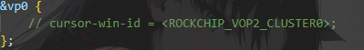
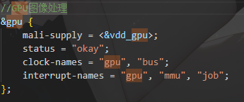
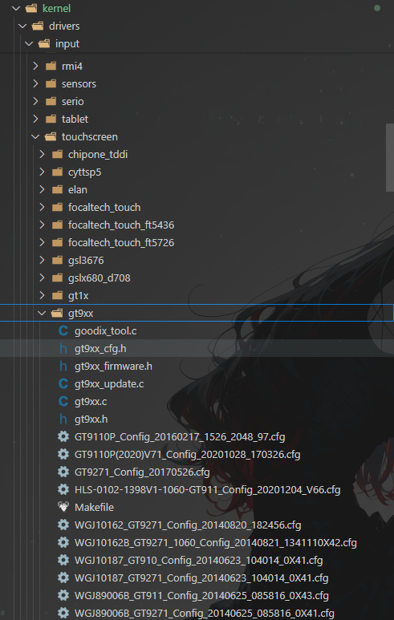
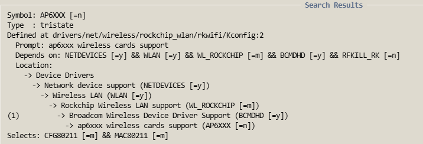
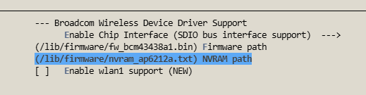
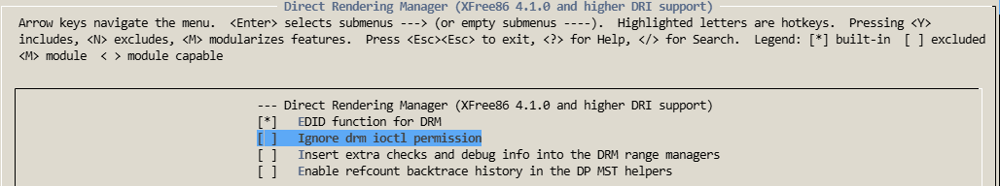
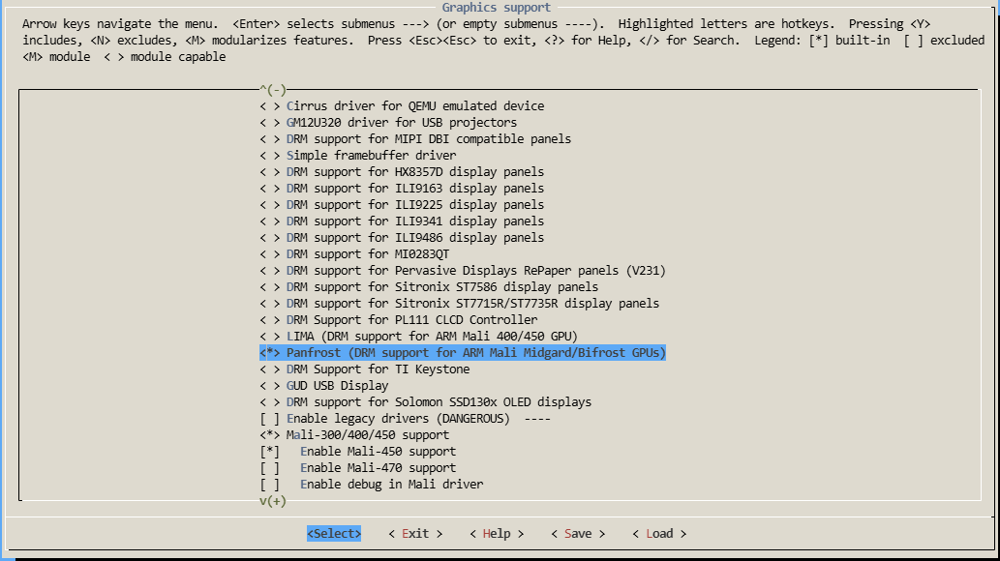
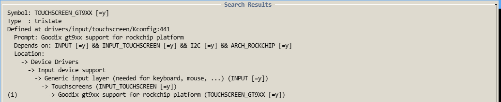
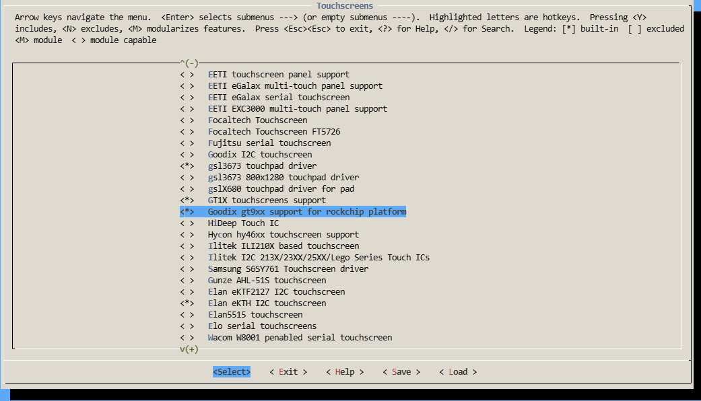
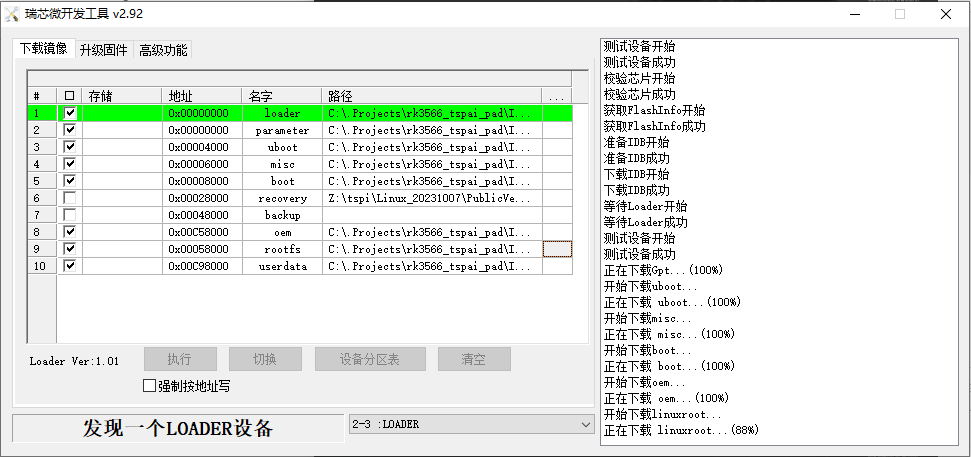

# 为RK3566泰山派编译ubuntu22.04.5+linux6.1.75记录

[TOC]

## 一、获取官方tspa_rk3566_linux_sdk

使用repo版本以方便自动同步目录。从文档中心选择下载

## 二、解压并同步sdk

参考官方给出方法

```shell
.repo/repo/repo sync -l -j$(nproc)
```

## 三、配置编译环境

Ubuntu:

```shell
sudo apt-get install git ssh make gcc libssl-dev liblz4-tool expect g++ patchelf chrpath gawk texinfo chrpath diffstat binfmt-support qemu-user-static live-build bison  flex fakeroot cmake gcc-multilib g++-multilib unzip device-tree-compiler ncurses-dev time cpio rsync
```

Arch拥有大部分包，执行sudo pacman -Syu更新即可
也可直接执行

```shell
sudo pacman -S git openssh make gcc openssl lz4 expect patchelf chrpath gawk texinfo diffstat qemu-user-static bison flex fakeroot cmake unzip dtc ncurses libnewt time cpio rsync
```

binfmt-support由自带的systemd-binfmt提供，缺失live-build库，不影响

## 四、选择内核

<del>
详细阅读https://github.com/ophub/kernel/blob/kernel_rk35xx/README.cn.md
从中挑选所需内核。这里选择codesnas/linux-6.1.y-rockchip
</del>

已经更换为<https://github.com/Joshua-Riek/linux-rockchip/tree/jammy>的release中的Ubuntu-rockchip-6.1.0-1027.27。tar.gz

## 五、替换内核

进入文件夹kernel，将原来的kernel命名为kernel_old，解压linux内核并命名为kernel文件夹。命令如下:

```shell
tar -xzvf Ubuntu-rockchip-6.1.0-1027.27.tar.gz
mv Ubuntu-rockchip-6.1.0-1027.27 kernel
```

## 六、导入设备树文件

把kernel_old中tspi开头的所有.dtsi和.dts文件复制到该目录下

```shell
cd kernel
cp ../kernel_old/arch/arm64/boot/dts/rockchip/tspi-rk3566-* arch/arm64/boot/dts/rockchip/
```

## 七、配置交叉编译工具链

进行板级配置`./build.sh launch`选择3，使用`./build.sh -h kernel`检查。
工具链需要指定到bin和lib文件夹。在build.sh中修改449行的build_check_cross_compile函数以便找到新安装的工具链

```Shell

#arm64|aarch64)
#  if [ -d "$TOP_DIR/prebuilts/gcc/linux-x86/aarch64/gcc-arm-10.3-2021.07-x86_64-aarch64-none-linux-gnu" ]; then
#  CROSS_COMPILE=$(realpath $TOP_DIR)/prebuilts/gcc/linux-x86/aarch64/gcc-arm-10.3-2021.07-x86_64-aarch64-none-linux-gnu/bin/aarch64-none-linux-gnu-
#  export CROSS_COMPILE=$CROSS_COMPILE
#  fi
#  ;;
#注释原来的458-463行并新增如下示例
arm64|aarch64)
if [ -d "/home/muli/toolchain/arm-gnu-toolchain-14.3.rel1-x86_64-aarch64-none-linux-gnu" ]; then
 CROSS_COMPILE=/home/muli/toolchain/arm-gnu-toolchain-14.3.rel1-x86_64-aarch64-none-linux-gnu/bin/aarch64-none-linux-gnu-
 export CROSS_COMPILE=$CROSS_COMPILE
 fi
 ;;
```

## 八、设备树修改

* ## 修改设备树以供适配硬件

### 屏幕驱动
  
使用屏幕为中电熊猫LM116LF1L01。设备树(相对路径 tspi_linux_sdk/kernel/arch/arm64/boot/dts/rockchip/tspi-rk3566-edp-v10.dtsi)配置

```c
edp_timing0: edp_timing0 {
  clock-frequency = <138500000>;
  hactive = <1920>;
  vactive = <1080>;
  hfront-porch = <48>;
  hsync-len = <32>;
  hback-porch = <80>;
  vfront-porch = <3>;
  vsync-len = <5>;
  vback-porch = <23>;
  hsync-active = <0>;
  vsync-active = <0>;
  de-active = <0>;
  pixelclk-active = <0>;
 };
```

### GPU驱动

在文件path/to/sdk/kernel/arch/arm64/boot/dts/rockchip/tspi-rk3566-core-v10.dtsi中注释掉vp0的内容

开启GPU


>clock-names = "gpu", "bus";
interrupt-names = "gpu", "mmu", "job";

### TP驱动

一般商家会给一个配置文件。将该配置文件替换原有的配置文件即可。我所使用的触摸屏驱动为GT928，就找gt9xx的驱动。如下

将.cfg文件放到该目录下

1. 修改设备树
在/home/muli/projects/tspi_linux_sdk/kernel/arch/arm64/boot/dts/rockchip/tspi-rk3566-dsi-v10.dtsi中

```c
&i2c1 {
    status = "okay";
    ts@5d {
        compatible = "goodix,gt9xx";
        reg = <0x5d>;
        tp-size = <89>;
        max-x = <1280>;
        max-y = <800>;
        touch-gpio = <&gpio1 RK_PA0 IRQ_TYPE_LEVEL_LOW>;
        reset-gpio = <&gpio1 RK_PA1 GPIO_ACTIVE_LOW>;
    };
};
```

搜索
2. 添加指定设备驱动
子啊

* ## 配置menuconfig

修改完文件后cd到kernel目录使用`make ARCH=arm64  rockchip_linux_defconfig menuconfig`选择功能的启用。

<font color="red">注意：</font>不同于官方文档的原因:使用该命令是为了从rockchip_linux_defconfig开始配置，避免一大堆无用的编译过程。尤其是较新的内核可能会导致编译不通过，直接运行`make ARCH=arm64 menuconfig`会包含大量驱动如amd intel nxp nouveau以及其他soc平台相关设备

### WIFI驱动

搜索AP6，按1并回车。进入


在Broadcom Wireless Device Driver Support中修改固件位置如下所示

> /lib/firmware/fw_bcm43438a1.bin
> /lib/firmware/nvram_ap6212a.txt

### 启用GPU

在Device Drivers -> Graphics support -> Direct Rendering Manager (XFree86 4.1.0 and higher DRI support)中设置Ignore drm ioctl permission为N


在Device Drivers -> Graphics support设置Panfrost (DRM support for ARM Mali Midgard/Bifrost GPUs)为Y


### 启用触摸驱动

按下/然后输入gt9回车，会看到如下图，然后按1

将Goodix gt9xx support for rockchip platform设置为Y


* ## 覆盖配置文件

<font color="red">建议事先备份原始rockchip_linux_defconfig</font>

更新配置文件`make ARCH=arm64 savedefconfig`
最后用配置文件替换默认配置文件使用`cp defconfig arch/arm64/configs/rockchip_linux_defconfig`

## 九、全编译/单独编译

<del>

### 全编译

</del>

回到sdk根目录
编译前需先进行板级配置，运行`./build.sh lunch`。选择3
再通过`./build.sh -h kernel`检查,应该输出如

```shell
###Current SDK Default [ kernel ] Build Command###
cd kernel
make ARCH=arm64 rockchip_linux_defconfig 
make ARCH=arm64 tspi-rk3566-user-v10-linux.img -j12
```

无误后选择buildroot开始构建,使用Buildroot构建`export RK_ROOTFS_SYSTEM=buildroot`

下面部分因兼容性问题暂时未找到好方法暂时搁置，直接跳至后面的单独编译部分

<del>

```shell
./build.sh all
./mkfirmware.sh
```

第一个命令会哟因为Arch的gcc版本过新(gcc15)导致编译出错，可使用<https://wiki.vrxiaojie.top/TSPI-tai-shan-pai-RK3566/%E7%AB%8B%E5%88%9B%E6%B3%B0%E5%B1%B1%E6%B4%BERK3566%E5%BC%80%E5%8F%91%E6%9D%BF/%E6%B3%B0%E5%B1%B1%E6%B4%BE%E7%BC%96%E8%AF%91Ubuntu22.04/%E7%BC%96%E8%AF%91Ubuntu22.04%E7%AC%94%E8%AE%B0.html#_2-3-%E5%B0%86wifi%E5%9B%BA%E4%BB%B6%E5%A4%8D%E5%88%B6%E8%BF%9Bubuntu>中提供的gcc-11进行安装，但仍然无法通过编译。

Buildroot 的编译流程：

* 第一阶段：宿主工具构建

> 使用宿主机 GCC 编译一些必要的宿主工具（host tools）
> 包括 host-m4、host-tar、host-lzip 等

* 第二阶段：交叉工具链构建
  
> Buildroot 会自己构建一套完整的交叉编译工具链
> 包括 binutils、gcc、g++、libc 等

* 第三阶段：目标系统构建

> 使用 Buildroot 自建的交叉工具链编译目标系统（RK3566）

</del>

### 单独编译

* uboot编译

cd至sdk根目录运行命令`./build.sh uboot`等待生成成功

* kernel编译

执行`./build.sh kernel`等待生成成功。最终会在rockdev下得到一个boot.img

若要检查编译得到的linux内核是否符合预期可执行下列命令

```shell
strings kernel/arch/arm64/boot/Image | grep "Linux version" | head -1
```

会得到如下的输出
> Linux version 6.1.75 (muli@archlinux) (aarch64-none-linux-gnu-gcc (Arm GNU Toolchain 14.3.Rel1 (Build arm-14.174)) 14.3.1 20250623, GNU ld (Arm GNU Toolchain 14.3.Rel1 (Build arm-14.174)) 2.44.0.20250616) # SMP

具体的信息视工具链和选择的内核而变

## 十、制作ubuntu22.04 rootfs

下载镜像源文件，前往<https://cdimage.ubuntu.com/>
进入Index of/ubuntu-base/release/22.04目录下载ubuntu-base-22.04-arm64.tar.gz

* 新建临时目录`mkdir temp`

* 解压

```shell
tar -xzvf ubuntu-base-22.04.5-base-arm64.tar.gz -C temp/
```

* ## 安装驱动模块

* 添加wifi驱动
  
```shell
sudo cp path/to/sdk/external/rkwifibt/firmware/broadcom/AP6212A1/wifi/nvram_ap6212a.txt path/to/temp/lib/firmware
sudo cp path/to/sdk/external/rkwifibt/firmware/broadcom/AP6212A1/wifi/fw_bcm43438a1.bin path/to/temp/lib/firmware
```

* 安装驱动模块到自制的rootfs

```shell
cd path/to/sdk/kernel
make ARCH=arm64 CROSS_COMPILE=aarch64-none-linux-gnu- rockchip_linux_defconfig #使用menuconfig配置的配置文件编译驱动模块
make ARCH=arm64 CROSS_COMPILE=aarch64-none-linux-gnu- modules #编译模块
make ARCH=arm64 modules_install INSTALL_MOD_PATH=path/to/temp #安装模块
```

* 准备网络:

```sh
sudo cp -b /etc/resolv.conf temp/etc/resolv.conf
```

* 准备qemu:

```shell
sudo cp /usr/bin/qemu-aarch64-static temp/usr/bin/
```

* ## 预制根文件系统

* 创建名为mount.sh且内容为

```shell
##!/bin/bash
mnt() {
 echo "MOUNTING"
 echo "path=${2}"
 sudo mkdir -p "${2}/proc"
 sudo mkdir -p "${2}/sys"
 sudo mkdir -p "${2}/dev"
 sudo mkdir -p "${2}/dev/pts"

 sudo mount -t proc /proc "${2}/proc"
 sudo mount -t sysfs /sys "${2}/sys"
 sudo mount -o bind /dev "${2}/dev"
 sudo mount -o bind /dev/pts "${2}/dev/pts"

}
umnt() {
 echo "UNMOUNTING"
 sudo umount "${2}/dev/pts"
 sudo umount "${2}/dev"
 sudo umount "${2}/sys"
 sudo umount "${2}/proc"
}

if [ "$1" == "-m" ] && [ -n "$2" ] ;
then
 mnt $1 $2
elif [ "$1" == "-u" ] && [ -n "$2" ];
then
 umnt $1 $2
fi
```

的挂载脚本给予权限并执行

```shell
sudo ./mount.sh -m temp/
```

PS:对于archlinux需安装qemu-user-static-binfmt

```shell
sudo pacman -S qemu-user-static-binfmt
```

然后运行`sudo systemctl start systemd-binfmt.service`

* 切换到根文件系统环境

```shell
sudo chroot temp/ /usr/bin/qemu-aarch64-static /bin/bash
```

* 运行`uname -a`检查：此处为(视机器而定)

> Linux archlinux 6.16.8-arch3-1 ##1 SMP PREEMPT_DYNAMIC Mon, 22 Sep 2025 22:08:35 +0000 aarch64 aarch64 aarch64 GNU/Linux

* 执行`chmod 1777 /tmp`，然后查看/tmp目录的权限,运行ll，应为drwxrwxrwt。否则后续`apt update`会失败

* 进行系统预定义组件安装

```shell
apt update
apt-get install gnupg -y
```

* 修改软件源:

```shell
cat > /etc/apt/sources.list.d/jjriek-ubuntu-rockchip-multimadia-jammy.list <<EOF 
deb https://launchpad.proxy.ustclug.org/jjriek/rockchip-multimedia/ubuntu jammy main 
```

* 设置包源优先级:

```shell
cat > /etc/apt/preferences.d/rockchip-multimedia <<EOF
Package:*
Pin:release o=LP-PPA-jjriek-rockchip-multimedia
Pin-Priority:1001
EOF
```

* 安装预装工具(可按需调整):

```shell
apt update 
apt upgrade
apt install ubuntu-desktop #ubuntu桌面,GNOME wayland渲染
apt install chromium-browser #浏览器
apt update ##(如果遇到W: GPG error: https://launchpad.proxy.ustclug.org/jjriek/rockchip-multimedia/ubuntu jammy InRelease: The following signatures couldn't be verified because the public key is not available: NO_PUBKEY F02122ECF25FB4D7则手动导入公钥apt-key adv --keyserver keyserver.ubuntu.com --recv-keys F02122ECF25FB4D7再进行apt update，否则不能安装rockchip-multimedia-config)
apt-get install -y sudo vim git ssh ethtool rsyslog bash-completion htop net-tools whois where ntp #基础系统工具
apt-get install -y network-manager ifupdown inetutils-ping wpasupplicant dbus-x11 #网络工具
apt-get install -y language-pack-en-base pulseaudio pavucontrol #语言包
apt-get install -y i2c-tools evtest xinput-calibrator #调试工具
apt-get install -y qtwayland5 gstreamer1.0-plugins-bad gstreamer1.0-plugins-good gstreamer1.0-plugins-base  mesa-* libegl1 libgbm1 libgles2 rockchip-multimedia-config #图形化相关工具
apt-get install -y libv4l2rd* v4l-utils #视频工具

/usr/sbin/useradd -s '/bin/bash' -m -G adm,sudo,video [username] ##创建用户民设置密码 [username]

passwd [username] ##设置密码
```

* 最后可用`id [username]`检查是否创建

* 退出系统使用 `exit`

## 十一.卸载镜像打包ubuntu系统镜像

如下操作均在制作根文件系统的根目录

```shell
sudo ./mount.sh -u temp/ #卸载镜像
mkdir rootfs
dd if=/dev/zero of=linuxroot.img bs=1M count=6000
mkfs.ext4 linuxroot.img
sudo mount linuxroot.img rootfs/
sudo cp -rfp temp/* rootfs/
sync
sudo umount rootfs/
e2fsck -p -f linuxroot.img
resize2fs -M linuxroot.img
```

## 十二、固件打包

将制作好的linuxroot.img组合到打包前文件。

```shell
cp linuxroot.img path/to/sdk/rockdev
cd path/to/sdk/rockdev 
mv linuxroot.img rootfs.img
chmod 644 rootfs.img
cd .. && ./mkfirmware.sh
```

## 十三、全打包或者使用烧录工具逐一填写并烧入

* ### windows

从下载的资料中找到path\to\lc-tspai-rk3566\第06章.【立创·泰山派】系统镜像\【镜像】Ubuntu,将config.cfg导入瑞星未开发工具，因为没有编译recovery.img，所以不勾选recovery。


然后依次填入编译的镜像即可，按照官方文档操作烧录
